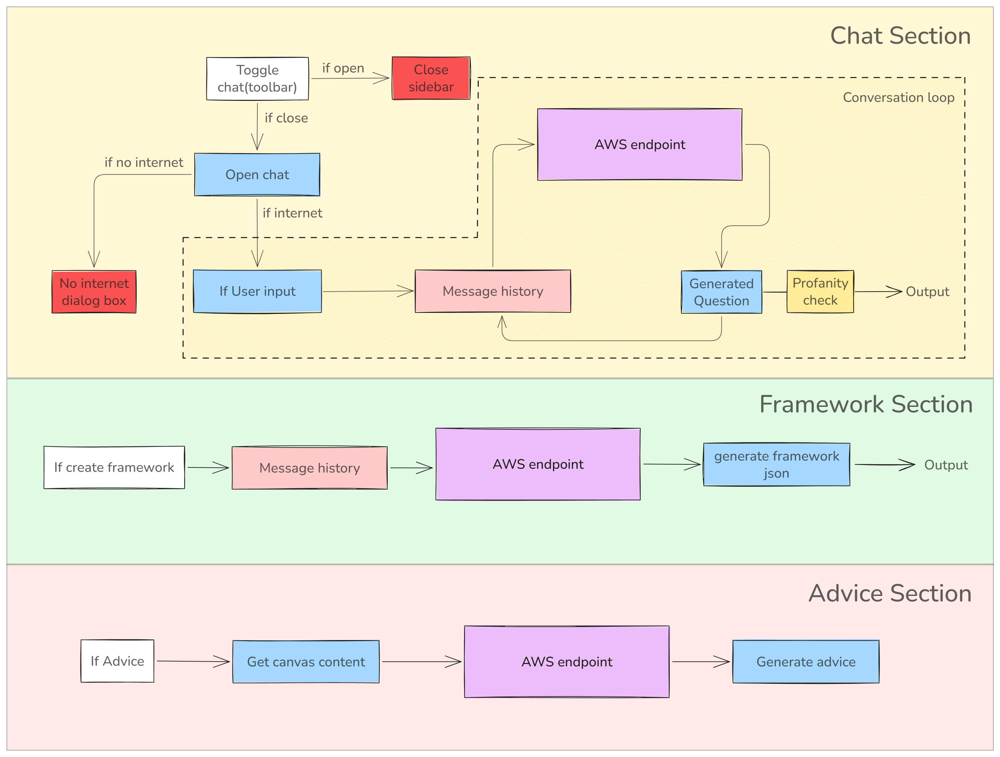

# How to contribute to the Story Builder Feature

This is an AI based feature that enables users to have a conversation with an AI personality(Mary Tales), create a story element based framework and get suggestions on what has been written.

--------

## 3 Sections of Story builder

## Setting up Sugar-AI

Since is an AI feature, we need to use the sugar-ai module. 

- 2 ways to use sugar-ai:
    - Locally with a model running on your machine --> [Sugar AI github](https://github.com/sugarlabs/sugar-ai)
    - Generating an API KEY to use the sugar-ai cloud service. You can do that [here](https://ai.sugarlabs.org)
        - Optionally, you can use another API service of your choice to bypass rate limits

- Set your API key value in the .env file here: `SUGAR_AI_API_KEY`
    - If running locally - `sugarai2024`
    - If running using the sugar-ai cloud service - `your_generated_api_key`

- Launch the activity and access all the 3 main features using the  icon in the toolbar section. 

- The endpoint in sugar-ai for the conversational chatbot & advice section is `/chat/completions` and for the framework creation we use `ask-llm-prompted` endpoint.

## Potential Issues:
- **Rate limits**  
These errors will get directly displayed on the chat section if they happen during a conversation. Keep a track on your own API usage of sugar ai at https://ai.sugarlabs.org. 
